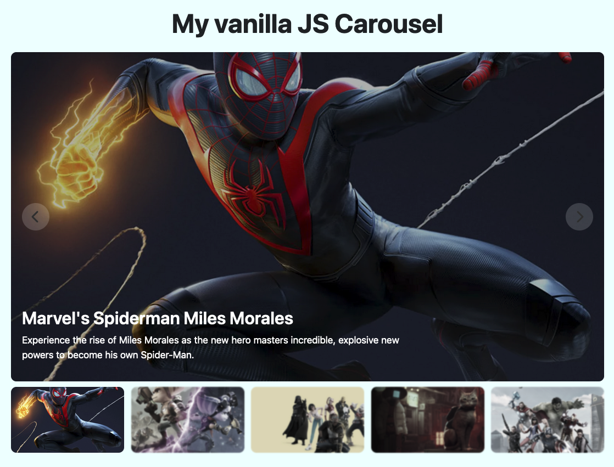

# vue-slider
Slider made with Vue JS  

<h2><strong>HOW IT WORKS:</strong></h2>
This carousel takes it's infos (img urls,img titles, img descriptions) from an Array of Ojects and it traduces them in a functioning carousel 

The carousel's cards automatically go forward every 3 seconds, but the user can choose to stop the automatic scroll moving the mouse hover the cards. Moving out the mouse will restart the auto scrolling feature.

The carousel also have buttons that allow the user to move to the next and the previous cards.

Finally, in the bottom of the cards there are the thumbnails, that show all the carousel's images, highlit the selected image, and give the user the opportunity to switch from an image to another directly clicking the related thumbnail.
 
<h3><strong>Have fun!</strong></h3>